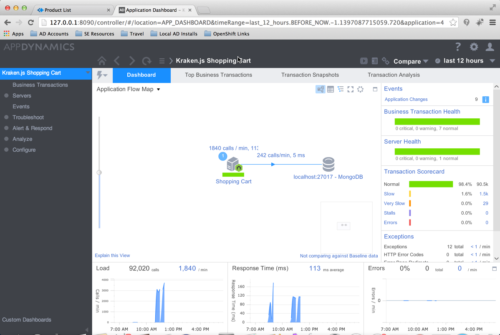
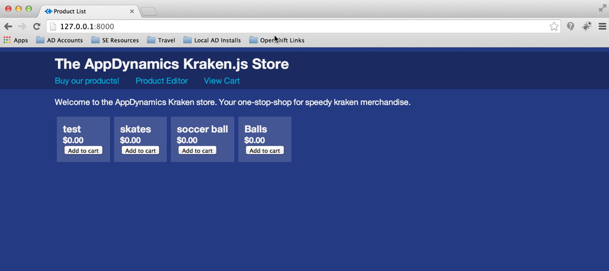
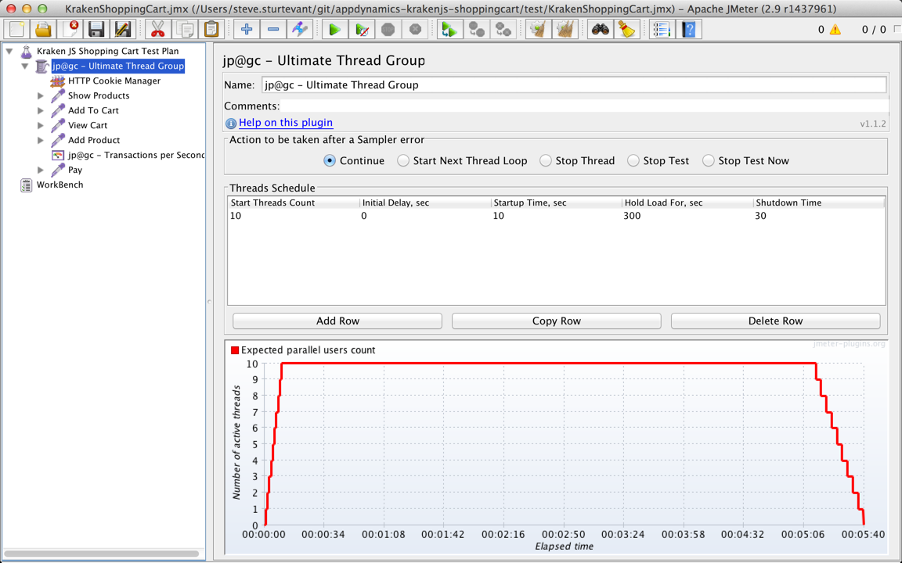

# Kraken.js Example Shopping Cart

A non-trivial [Node.js](www.nodejs.com) application, built on top of PayPal's [Kraken.js](www.krakenjs.com) framework.  This app demonstrates a basic shopping cart and CRUD inventory management capability.  

[MongoDB](www.mongodb.com) is used to manage the internal inventory system, and payments are simulated using PayPal's REST SDK against their Sandbox API environment, [api.sandbox.paypal.com](api.sandbox.paypal.com).

This example was built from the [Kraken.js Shopping Cart Tutorial](https://github.com/lmarkus/Kraken_Example_Shopping_Cart).
## Known Issues
   + AppDynamics is not recognizing HTTP calls to PayPal as backend HTTP transactions

# Pre-Requisites
## Node.js
Node.js v0.8+ is required.
## MongoDB
MongoDB must be installed and running on the localhost using the default port 27017.  You can point to a remote instance of MongoDB by updating **${APP_ROOT}**/config/app.json.

## AppDynamics
The AppDynamics 3.8 Node.js Beta Agent has been installed as part of the application using **npm install**, it is installed to **${APP_ROOT}**/node_modules/appdynamics.

The Agent is enabled, and configured, in ${ROOT_DIR}/index.js.  Update the Controller: HostName, Port, Application Name, Tier Name, and Node name as needed.

	`require("appdynamics").profile({
  		controllerHostName: '127.0.0.1',
		controllerPort: 8090,
		accountName: '', //Required for a controller running in
		multi-tenant mode.accountAccessKey: '', //Required for a
		controller running in multi-tenant mode.
		applicationName: 'Kraken.js Shopping Cart',
		tierName: 'Shopping Cart',
		nodeName:'osxltsturt', //Prefix to the full node name.
		debug: true //Debug is optional; defaults to false.
	});`
	
.

#Starting the Application
From **${APP_ROOT}**, running **npm start** will launch the shopping cart application.  By default, you can access the app at: [http://127.0.0.1:8000/](http://127.0.0.1:8000/).

.

**NOTE** There is a bug on the product page displaying item price.

#Generating Load with JMeter
An [Apache JMeter](www.jmeter.org) script is included in **${APP_ROOT}**/test/KrakenShoppingCart.jmx.

To run the jmeter test, download the latest [Apache JMeter](https://jmeter.apache.org/download_jmeter.cgi) and the [Extras Set](http://jmeter-plugins.org/downloads/file/JMeterPlugins-Extras-1.1.3.zip) of plugins from [jmeter-plugins.org ](jmeter-plugins.org).  

##JMeter Plugins Installation Guide
The included JMeter script uses the Utlimate Thread Group, and a Transactions / Second display which is not included in the base jmeter installation.  To add the Plugins extensions:

   + Go to [downloads](http://jmeter-plugins.org/downloads/file/JMeterPlugins-Extras-1.1.3.zip) page
   + Choose the plugins set according to your tasks (or get all of them if you want to explore all existing plugins)
   + Extract archive contents to JMeter installation directory, the plugins should install to **${JMETER_HOME}/lib**
   + Restart JMeter to load new plugins

.

#Analyzing Kraken.js Shopping Cart in AppDynamics

